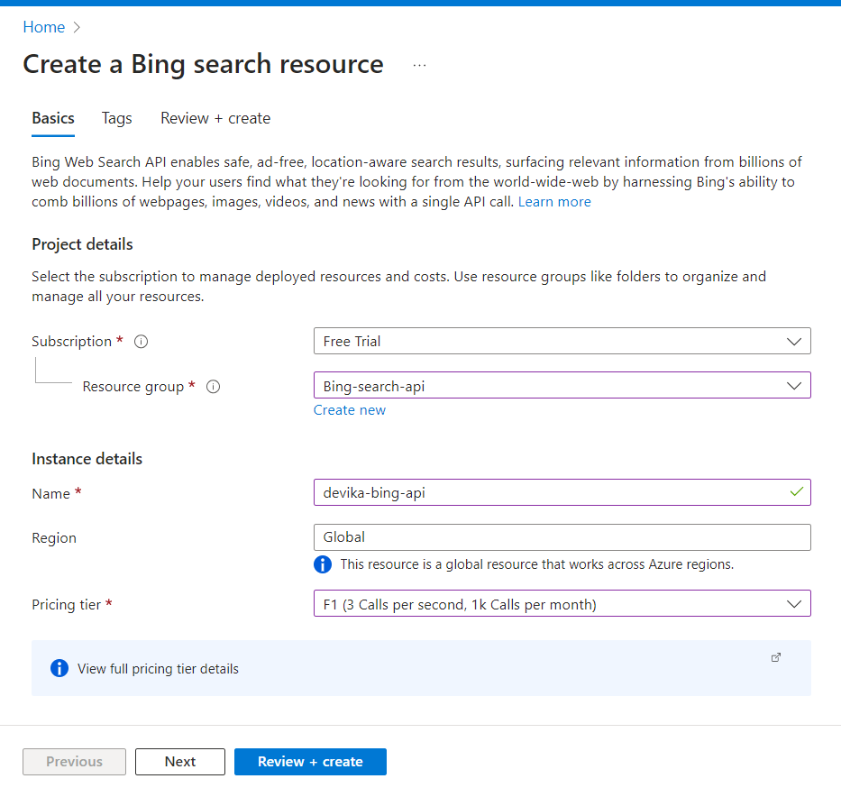
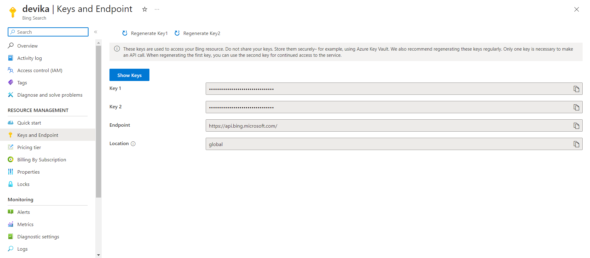
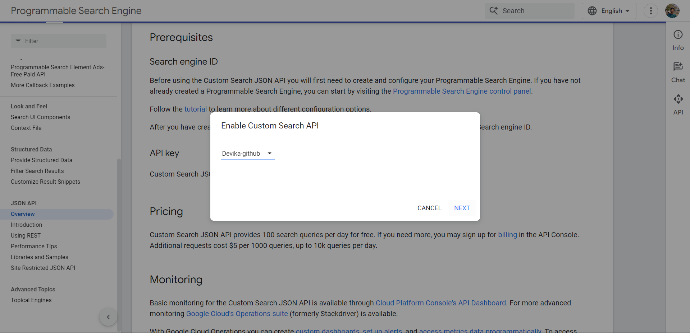
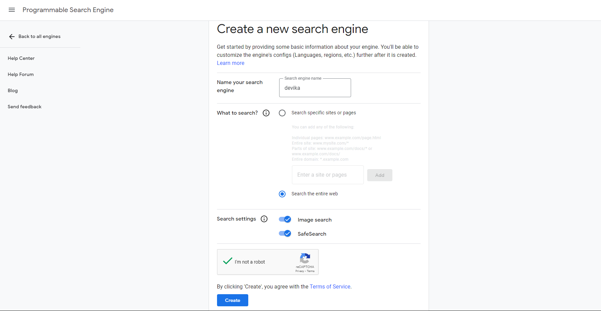

# search Engine setup

To use the search engine capabilities of Devika, you need to set up the search engine API keys. Currently, Devika supports Bing, Google and DuckDuckGo search engines. If you want to use duckduckgo, you don't need to set up any API keys.

For Bing and Google search engines, you need to set up the API keys. Here's how you can do it:

## Bing Search API
- Create Azure account. You can create a free account [here](https://azure.microsoft.com/en-us/free/). 
- Go to the [Bing Search API](https://www.microsoft.com/en-us/bing/apis/bing-web-search-api) website.
- click on the `Try now` button.
- Sign in/sign up with your Azure account.
- Create a new resource group (if you don't have any).

- click on the `Review and create` button.
- if everything is fine, click on the `Create` button.
- Once the resource is created, go to the `Keys and Endpoint` tab.

- Copy either `Key1` or `Key2` and paste it into the `API_KEYS` field with the name `BING` in the `config.toml` file located in the root directory of Devika, or you can set it via the UI.
- Copy the `Endpoint` and paste it into the `API_Endpoints` field with the name `BING` in the `config.toml` file located in the root directory of Devika, or you can set it via the UI.

## Google Search API
- if don't have then create GCP account [Google Cloud Console](https://console.cloud.google.com/).
- visit [Here](https://developers.google.com/custom-search/v1/overview) is the official documentation.
- click on `Get a Key`.
- select the project you have or create a new project. click on next.

- it enable the Custom Search API for the project and create the API key.
- Copy the API key and paste it in the API_KEYS field with the name `GOOGLE_SEARCH` in the `config.toml` file in the root directory of Devika or you can set it via UI.
- for the search engine id, go to the [Google Custom Search Engine](https://programmablesearchengine.google.com/controlpanel/all) website.
- click on the `Add` button.

- After creating the engine. Copy the `Search Engine ID` and paste it in the API_Endpoints field with the name `GOOGLE_SEARCH_ENGINE_ID` in the `config.toml` file in the root directory of Devika or you can set it via UI.
